# `panelview` in Stata: Visualizing Panel Data

The **`panelview`** package has three main functionalities:

(1) it plots the treatment status and missing values in a panel dataset;

 (2) it visualizes variables of interest in a time-series fashion; 

(3) it depicts the bivariate relationships between a treatment variable and an outcome variable either by unit or in aggregate.

These tools can help researchers better understand their panel data before conducting statistical analysis.

------

**Date:** Feb 4, 2023

**Version:** 0.1.4 ([Github](https://github.com/xuyiqing/panelview_stata)); 0.1.3 (Stata Statistical Software Components (*SSC*) archive)

**Authors:** Hongyu Mou, Yiqing Xu

**Reference:** Hongyu & Yiqing Xu. "panelview for visualizing panel data: a Stata package." Available at Statistical Software Components (SSC) archive.

**Update in v.0.1.4:** 

1. Provide tables on variables examined for missing values when using the `treat` or `missing` type. 
1. Add `collapsehistory` option to plot only the unique treatment histories, including figures alongside the plot for the number of units whose histories are characterized by each pattern.
1. Change color for the the `outcome` type plot.
1. Add note for the the `treat` or `missing` type to indicate that the white cells represent missing values/observations in data.

Please report bugs to  hongyumou@g.ucla.edu or yiqingxu@stanford.edu.

We thank Yifan Huang for an early version of the program and Ziyi Liu for helpful suggestions.

------

__Table of Contents__

[TOC]

------

## 0. Installation

Firstly, users need to install several dependencies: `grc1leg`, ` gr0075`, `labutil`, and `sencode`.

```
net install grc1leg, from(http://www.stata.com/users/vwiggins) replace
net install gr0075, from(http://www.stata-journal.com/software/sj18-4) replace
ssc install labutil, replace
ssc install sencode, replace
```

Then to install the `panelview` package with Stata version 15.1 or greater, one way is by typing `ssc install`: 

```
cd "your_full_local_path_to_ado_folder"
ssc install panelview, all
```

Another way is using `net install` to install the up-to-date version of `panelview`: 

```
cap ado uninstall panelview //in-case already installed
net install panelview, all replace from("https://yiqingxu.org/packages/panelview_stata")
```

------

## 1. Syntax

An overview of the syntax is below. Note that *Y*, *D*, and *X* in the table are simply labels; they can represent any variable in a panel dataset.

| Sata.formula | Option              | Type        | Function                                                     |
| :----------- | :------------------ | ----------- | ------------------------------------------------------------ |
| Y D X        |                     | `missing`   | show missingness in Y, D, or X.                              |
| Y            |                     | `missing`   | show missingness in Y.                                       |
| Y D X        |                     | `treat`     | show treatment status of D given complete data in  Y, D, and X. |
| D X          | `ignoreY`           | `treat`     | show treatment status of D given complete data in  D and X.  |
| D            | `ignoreY` (default) | `treat`     | show treatment status of D.                                  |
| Y D X        |                     | `outcome`   | show time-series of Y colored in D given complete data in Y, D, and X. |
| Y            |                     | `outcome`   | show time-series of Y.                                       |
| Y D X        |                     | `bivariate` | show relationship of Y and D given complete data in Y, D, and X. |

The general syntax of the package can be summarized as:

```
panelview Y [D X] [if] [in], 			      ///
	i(varname) t(varname numeric)	      ///
	type(string)						   					///
	[									  				 				///
	continuoustreat						   				///
	discreteoutcome						   				///
	bytiming							   						///
	ignoretreat							   				  ///
	ignoreY															///
	MYCOLor(string)						   				///
	PREpost					 			   						///
	xlabdist(integer 1)					   			/// 
	ylabdist(integer 1)					  		  ///
	bygroup								   						///
	style(string)						   					///
	byunit								   						///
	theme(string)						   					///
	lwd(string)							   					///
	leavegap														///
	bygroupside   											///
  displayall													///
  bycohort														///
  collapsehistory											///
	*									   								///
	]
```

where the subcommand can be:

| Subcommand                | Description                                                  |
| :------------------------ | ------------------------------------------------------------ |
| `Y D X`                   | `varlist` of outcome variable, treatment variable, and covariates, respectively. Including covariates may change the look of the plot due to missing values in these covariates. |
| `if` and `in`             | We recommend users to add variable that is not included in the `varlist` or `i()` / `t()` but appears in the `if`/ `in` subcommand to the  `varlist` following `panelview` command. |
| `i()` and `t()`        | Specify the unit (group) and time indicators.                |
| `type()`               | Use `type(treat)` to plot treatment assignment using a heatmap. Use `type(outcome)` to plot an outcome variable---or any variable---in a time series fashion. Use `type(bivar)` or `type(bivariate)` to plot the outcome and treatment variables against time in the same graph. Use `type(miss)` or `type(missing)` to plot the missing data status of a variable. |
| `continuoustreat` | The treatment variable is presented as a continuous variable. |
| `discreteoutcome`         | When a variable is discrete, make sure `panelview` respects its discreteness in `type(outcome)` plots. |
| `bytiming`                | Sort units by the timing of first receiving the treatment; if the timing is the same, then by the total number of periods exposed to the treatment. |
| `ignoretreat` | Omit the treatment indicator, that is, any variables after `Y` will be interpreted as covariates. |
| `ignoreY` | Show treatment status of the first variable in the varlist instead of the second (e.g., D in formula is D X, instead of X). It needs to be combined with `type(treat)` or `type(missing)` . If there is only one variable in the varlist, the option is turned on by default. |
| `MYCOLor()`               | Change the color schemes; click [here](http://repec.sowi.unibe.ch/stata/palettes/help-colorpalette.html) for sequential colors (3-9 colors). |
| `PREpost`            | Distinguish the pre- and post-treatment periods for treated units. |
| `xlabdist()` and `ylabdist()` | Change integer gaps between labels on the x- and y-axes. Default is 1. |
| `bygroup`            | Put each unit into different treatment groups, then plot them separately in a column when `type(outcome)` is invoked. |
| `style()`        | Determine the style of the elements in a plot.  The first and second entries define the style of the outcome and treatment, respectively. `connected` or `c` for connected lines, `line` or `l` for lines, `bar` or `b` for bars. |
| `byunit`                  | Plot the outcome and treatment variables against time by each unit when `type(bivar)` is invoked. |
| `theme(bw)`               | Use the black and white theme (default when specified `type(bivar)`). |
| `lwd()`             | Set the line width in `type(bivar)`  (default is `medium`).  |
| `leavegap` | Keep the time gap as a white bar if time is not evenly distributed (possibly due to missing data). |
| `bygroupside` | Arrange subfigures of `bygroup` in a row rather than in a column. |
| `displayall` | Show all units if the number of units is more than 500, otherwise we randomly select 500 units to present. |
| `bycohort` | Plot the average outcome lines based on unique treatment history. |
| `collapsehistory` | Plot only the unique treatment histories, including figures alongside the plot for the number of units whose histories are characterized by each pattern. |

------

## 2. Plotting Treatment Conditions

First, we show how to visualize the dichotomous treatment in a panel dataset. The treatment may  switch on and off or have missing values.

### 2.1 Two treatment conditions

Using the `turnout` dataset (a balanced panel), we show the treatment status of Election Day Registration (EDR) in each state in a given year ([Xu 2017](http://dx.doi.org/10.1017/pan.2016.2)). We can use the `title` option to change the title of the plot and change the titles of x- and y-axes through `xtitle` and `ytitle`, respectively. For DID-type panel data with a dichotomous treatment indicator, we can distinguish the pre- and post-treatment periods for treated units by specifying `prepost`.

In the plot below,` turnout` is the outcome, `policy_edr` is the treatment, `policy_mail_in` and `policy_motor` are covariates. Including covariates may change the plot because of missing values in these covariates.

```
use turnout.dta, clear 
panelview turnout policy_edr policy_mail_in policy_motor, i(abb) t(year) type(treat) xtitle("Year") ytitle("State") title("Treatment Status")
```

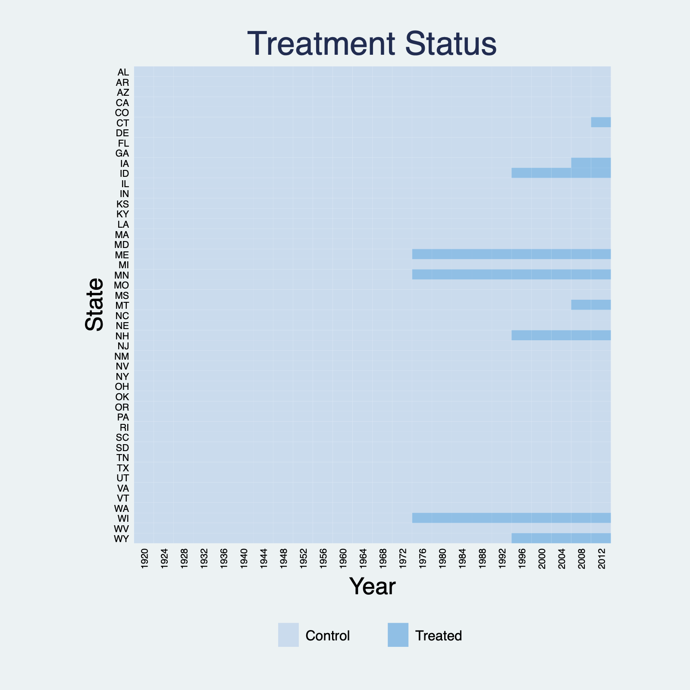

We can use the `bytiming` option to sort units by the timing of receiving the treatment (then by the total number of periods exposed to the treatment). We also use `legend` to change labels in the legend: 

```
*bytiming
panelview turnout policy_edr policy_mail_in policy_motor, i(abb) t(year) type(treat) xtitle("Year") ytitle("State") title("Treatment Status") bytiming legend(label(1 "No EDR") label(2 "EDR"))
```

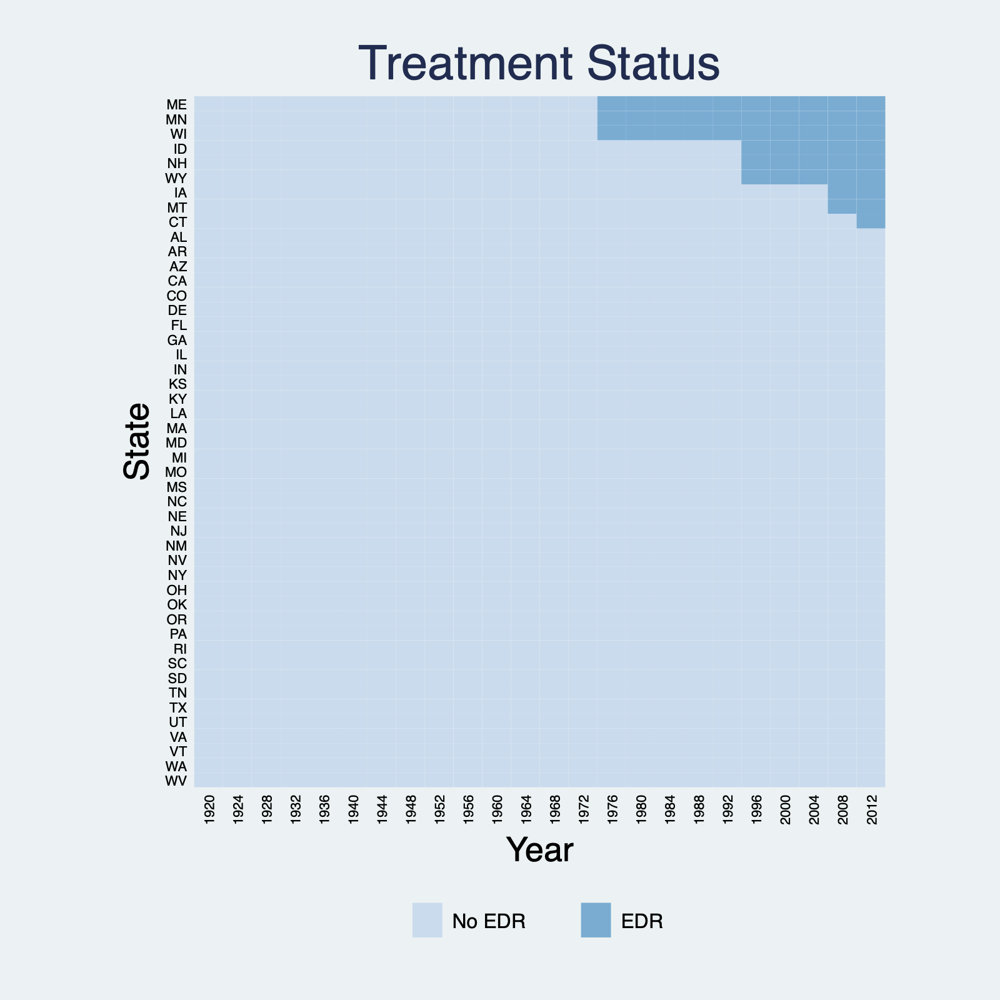

Distinguish the pre- and post-treatment periods for treated units by specifying `prepost`: 

```
*prepost
panelview turnout policy_edr policy_mail_in policy_motor, i(abb) t(year) type(treat) xtitle("Year") ytitle("State") title("Treatment Status") prepost
```

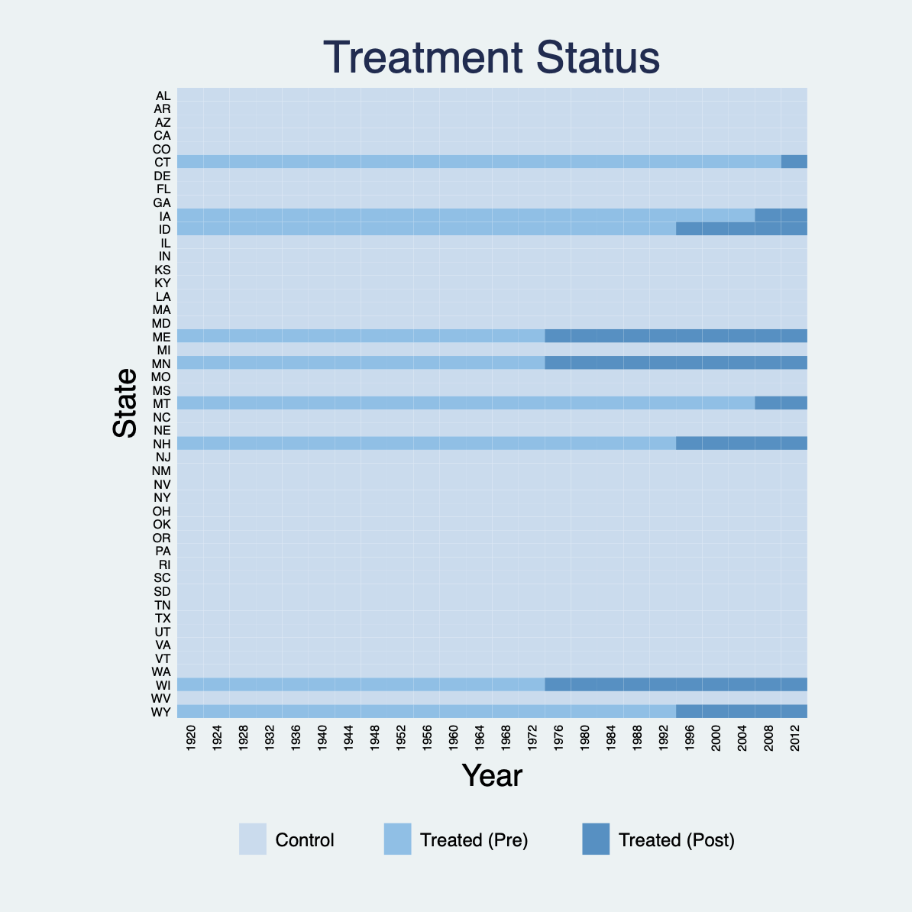

Again, sort units by the timing of receiving the treatment:

```
*bytiming
panelview turnout policy_edr policy_mail_in policy_motor, i(abb) t(year) type(treat) xtitle("Year") ytitle("State") title("Treatment Status") prepost bytiming
```

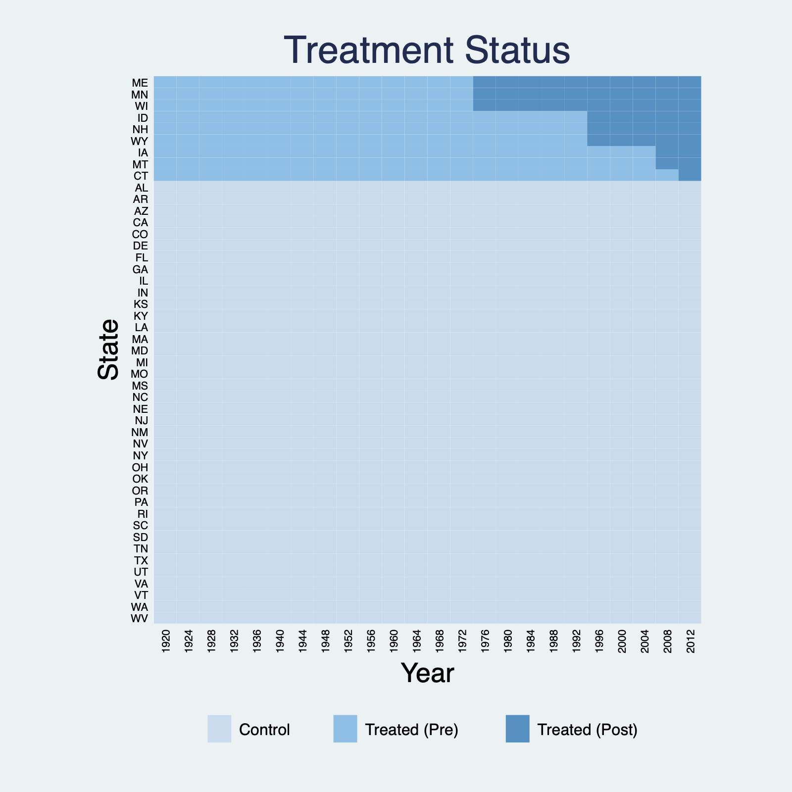

Remove the labels on the y-axis by specifying `ylabel("")` or `ylabel(none)`: 

```
panelview turnout policy_edr policy_mail_in policy_motor, i(abb) t(year) type(treat) title("EDR Reform") ylabel("")
```

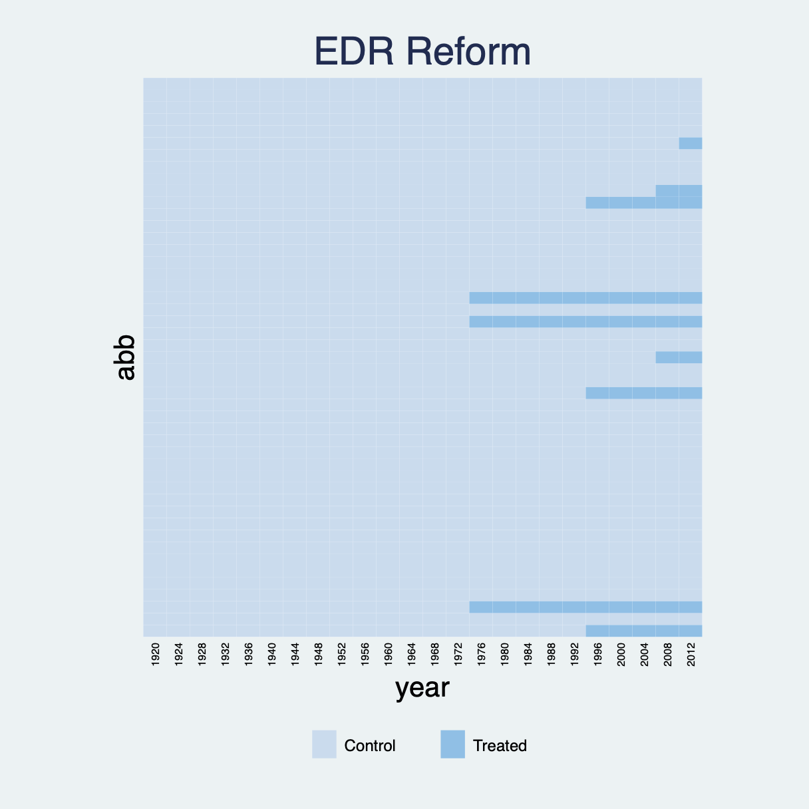

Change the color schemes for the controls and treated using the `mycolor` option. For example, `PuBu` indicates light purple to blue. Click [here](http://repec.sowi.unibe.ch/stata/palettes/help-colorpalette.html) for more sequential colors' choice.

```
*mycolor(PuBu)
panelview turnout policy_edr policy_mail_in policy_motor, i(abb) t(year) type(treat) xtitle("Year") ytitle("State") title("Treatment Status") mycolor(PuBu) bytiming 
```


If time is not evenly distributed, we can use `leavegap` to keep the time gap as an white bar. Otherwise, we will skip the time gap with an warning "Time is not evenly distributed (possibly due to missing data)."

```
*leavegap
drop if year==1924
drop if year==1928
drop if year==1940
panelview turnout policy_edr policy_mail_in policy_motor, i(abb) t(year) type(treat) leavegap
```

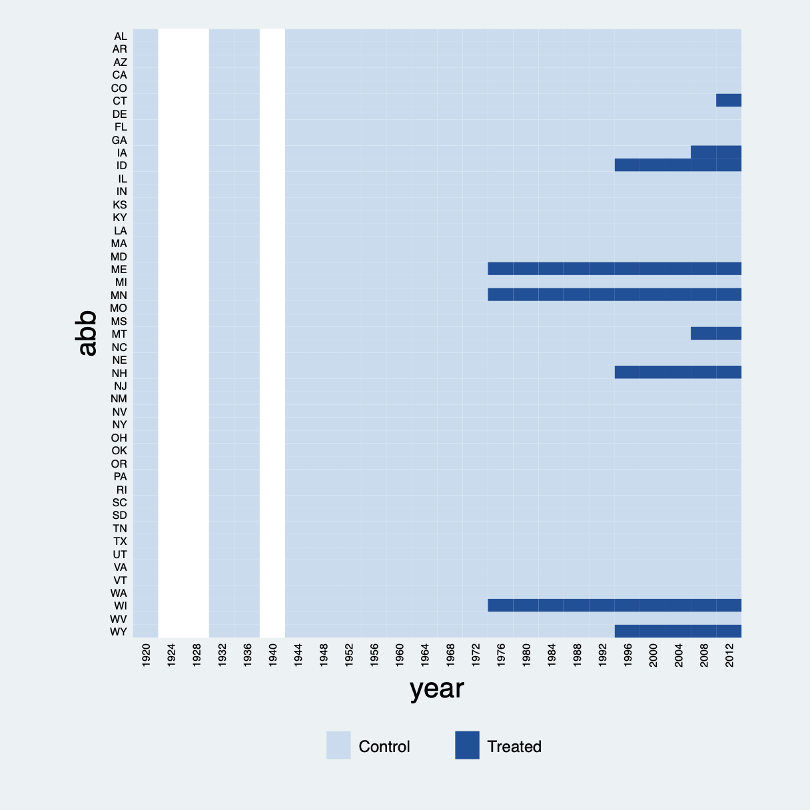

### 2.2 Treatment: missing & switch on and off

For a panel dataset in which the treatment may switch on and off, we no longer differentiate between pre- and post-treatment statuses. To demonstrate how `panelview` can be used in a more general setting, the following plot uses the `capacity` dataset, which is used to investigate the effect of democracy, the treatment, on state capacity, the outcome ([Wang and Xu 2018](http://journals.sagepub.com/doi/full/10.1177/2053168018772398)). `demo` is a binary indicator of regime type. From the figure below, we see quite a few cases of democratic reversals and that there are many missing values (the white area). We use the `xlabdist` and   `ylabdist` option to change the gaps between labels on the x- and y-axes: 

```
use capacity.dta, clear
panelview lnpop demo lngdp , i(country) t(year) type(treat) mycolor(Reds) title("Democracy and State Capacity") xlabdist(3) ylabdist(10)
```

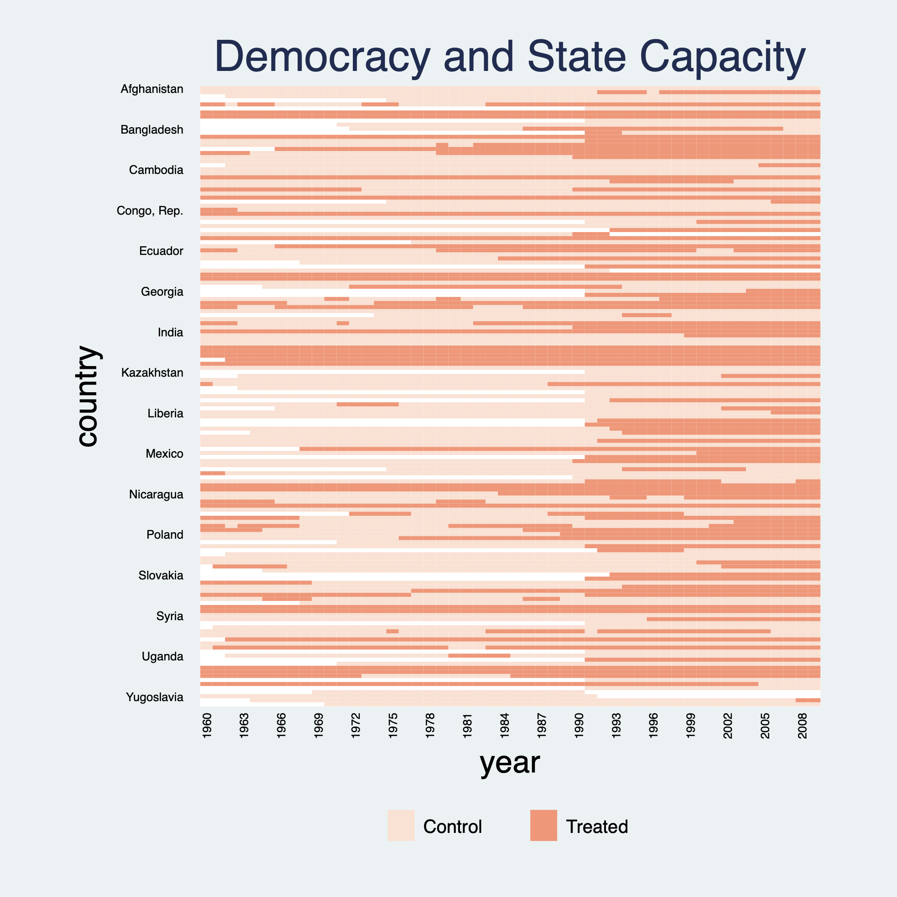

If the varlist formula is D X, instead of Y D X, we can use `ignoreY` to show treatment status of D, which do not take the missing status of Y into consideration: 

```
*ignoreY
panelview demo lngdp , i(country) t(year) type(treat) mycolor(Reds) title("Democracy and State Capacity") xlabdist(3) ylabdist(10) ignoreY
```

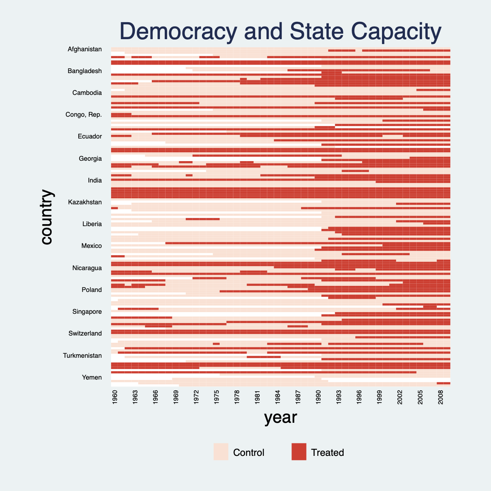

Sorting units based on the first period a unit receives the treatment gives a more appealing visual:

```
*bytiming
panelview lnpop demo lngdp, i(country) t(year) type(treat) mycolor(Reds) title("Democracy and State Capacity") xlabdist(3) ylabdist(10) bytiming
```

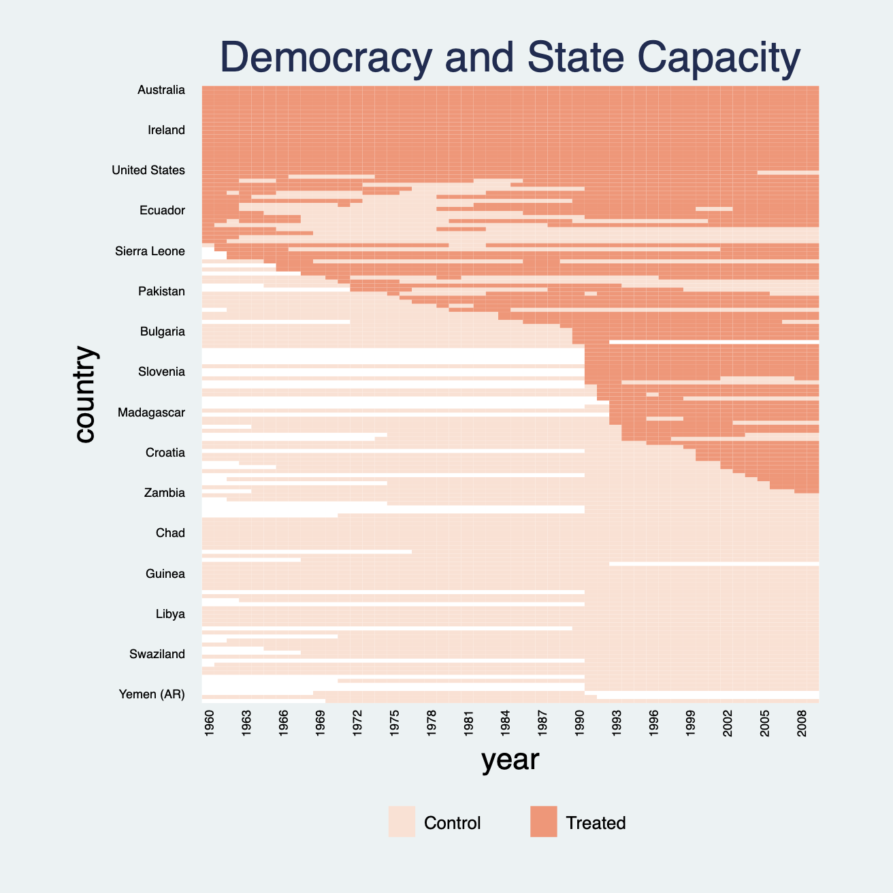

If the number of units is too much, we can use `collapsehistory` to plot only the unique treatment histories, including figures alongside the plot for the number of units whose histories are characterized by each pattern: 

```
*collapsehistory
panelview lnpop demo lngdp, i(country) t(year) type(treat) xlabdist(3) collapsehistory title("Unique Treatment Histories")
```

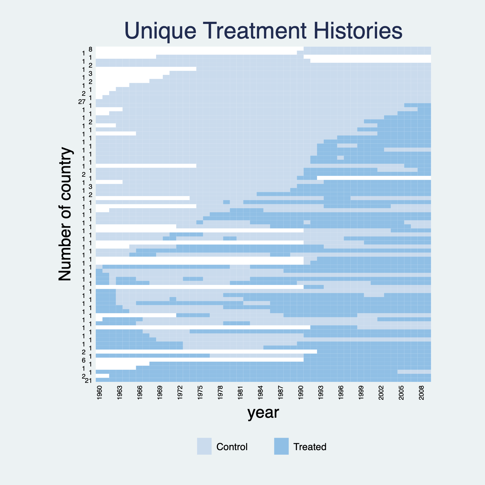

Instead of indicate `country` as units, we use `i(ccode)` to indicate country code as units, which will change the label and sequence in our figure:

```
panelview lnpop demo lngdp, i(ccode) t(year) type(treat) mycolor(PuBu) title("Democracy and State Capacity") xlabdist(3) ylabdist(10)
```

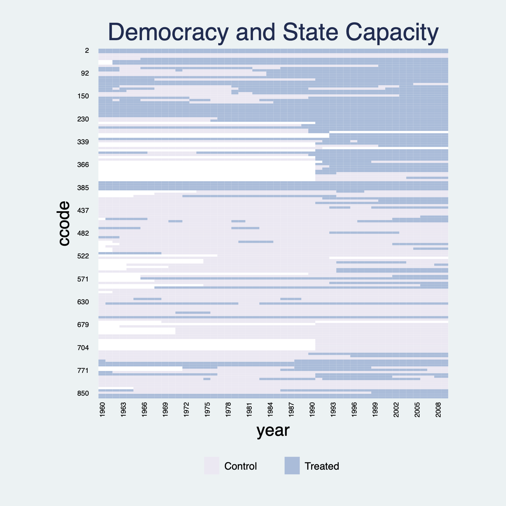

Sort units based on the first period a unit receives the treatment and use `ylabel(none)` to remove the labels on the y-axis:

```
*bytiming
panelview lnpop demo lngdp, i(ccode) t(year) type(treat) mycolor(PuBu) title("Democracy and State Capacity: Treatement Status", size(medsmall)) bytiming xlabdist(3) ylabel(none) 
```

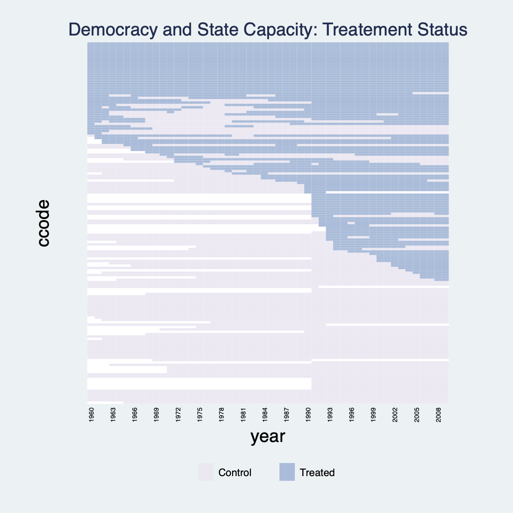

### 2.3 Plotting a subset of units

Sometimes a dataset has many units and we only want to take a peak of a subset of the units. **panelview** allows users to specify the units to be shown by the `if` subcommand. Note that if any variable not included in the `varlist` or `i()` / `t()` following `panelview` appears in the `if` or `in` command, we recommend researchers to add such variable into the  `varlist` following `panelview`. In the following figure, we plot the treatment statuses of the first 25 units:

```
use capacity.dta, clear
egen ccodeid = group(ccode)
panelview lnpop demo lngdp ccodeid if ccodeid >= 1 & ccodeid <= 26, i(ccode) t(year) type(treat) mycolor(PuBu) title("Democracy and State Capacity") xlabdist(3)
```

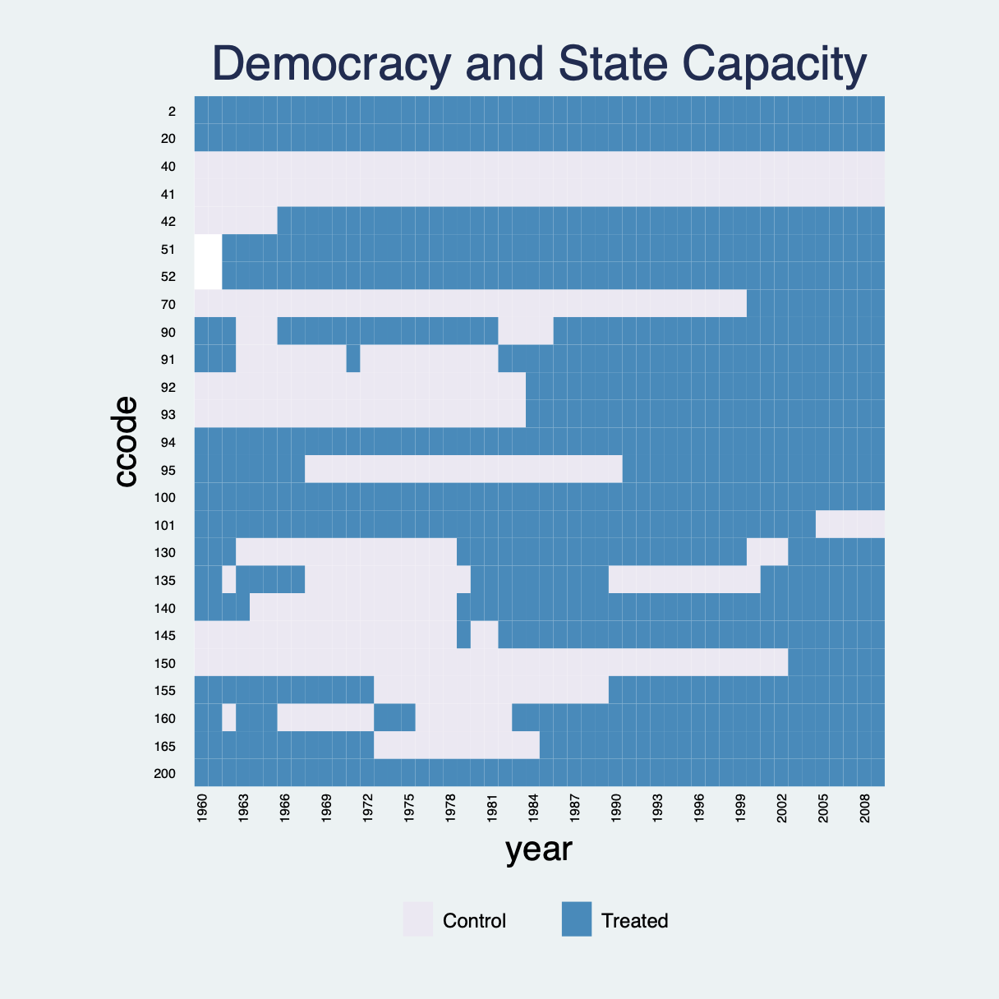

Sort units based on the first period a unit receives the treatment: 

```
*bytiming
panelview lnpop demo lngdp ccodeid if ccodeid >= 26 & ccodeid <= 51, i(ccode) t(year) type(treat) mycolor(PuBu) title("Democracy and State Capacity") xlabdist(3) bytiming
```

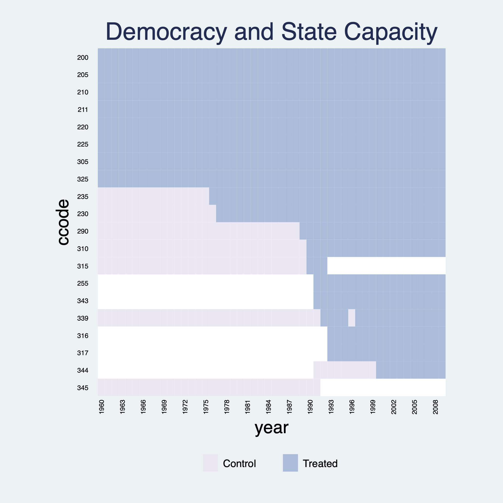

------

## 3. Ignoring Treatment Conditions

### 3.1 `ignoretreat` subcommand

When we omit the treatment variable in a `type(treat)` plot, the plot will show missing (the white area) and non-missing values only. Another way to achieve this goal is to set `type(missing)`.

```
use capacity.dta, clear
panelview demo, i(ccode) t(year) type(treat) mycolor(Reds) title("Missing Values") xlabel(none) ylabel(none) ignoretreat
```

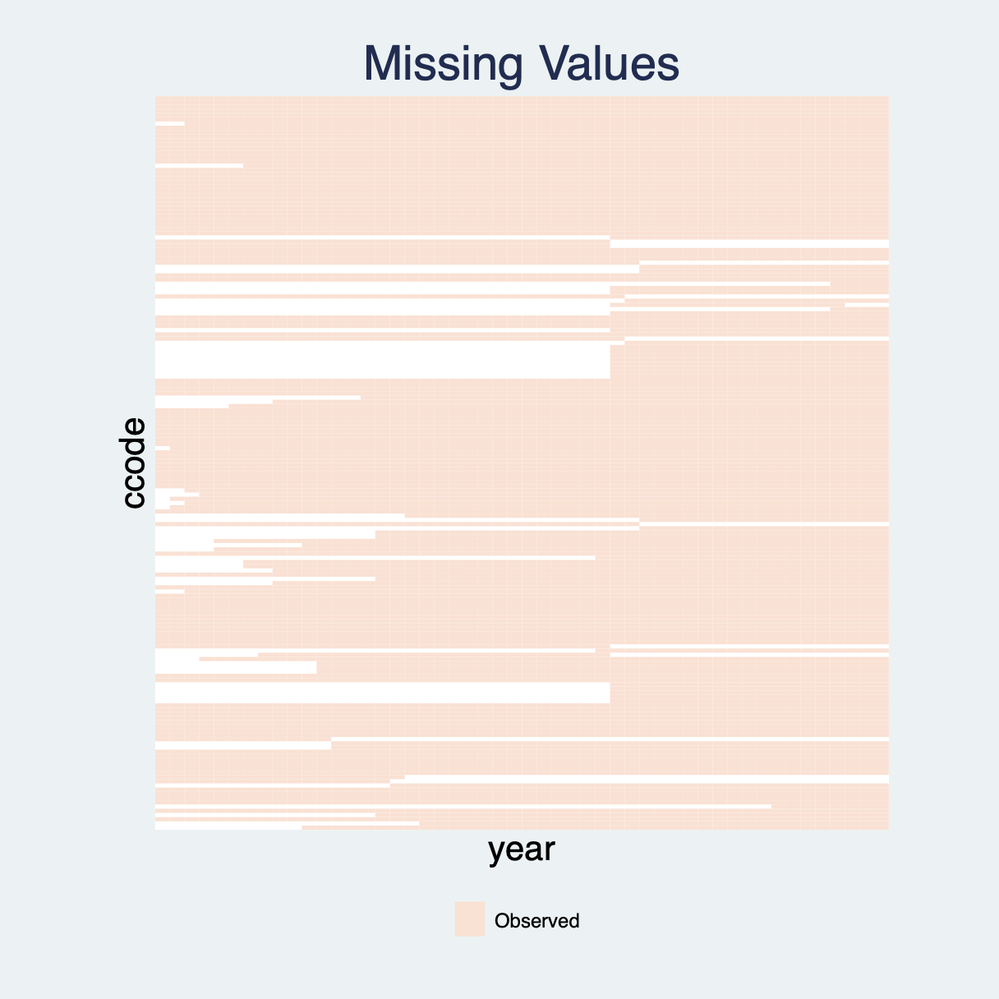

We can also combine with `leavegap` to plot an vertical white bar if time is not evenly distributed (possibly due to missing data): 

```
*leavegap
replace demo=. if year==1960
replace demo=. if year==1980
replace lngdp=. if year==1990
panelview demo lngdp, i(ccode) t(year) type(missing) mycolor(Reds) leavegap ylabel(none)
```

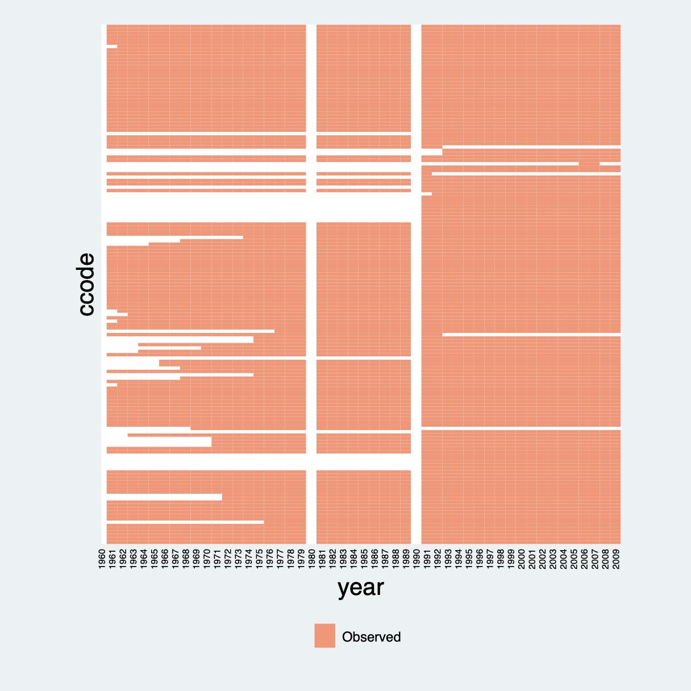

### 3.2 Treatment level = 1 & Plotting treatment

If the treatment indicator has only 1 level, then treatment status will not be shown in the `type(treat)` plot, which is the same as `ignoretreat`: 

```
use capacity.dta, clear
gen demo2 = 0
panelview Capacity demo2 lngdp, i(ccode) t(year) type(treat) title("Regime Type") xlabdist(3) ylabdist(10) legend(off) // type(treat) & number of treatment level = 1: same as ignoretreat
```

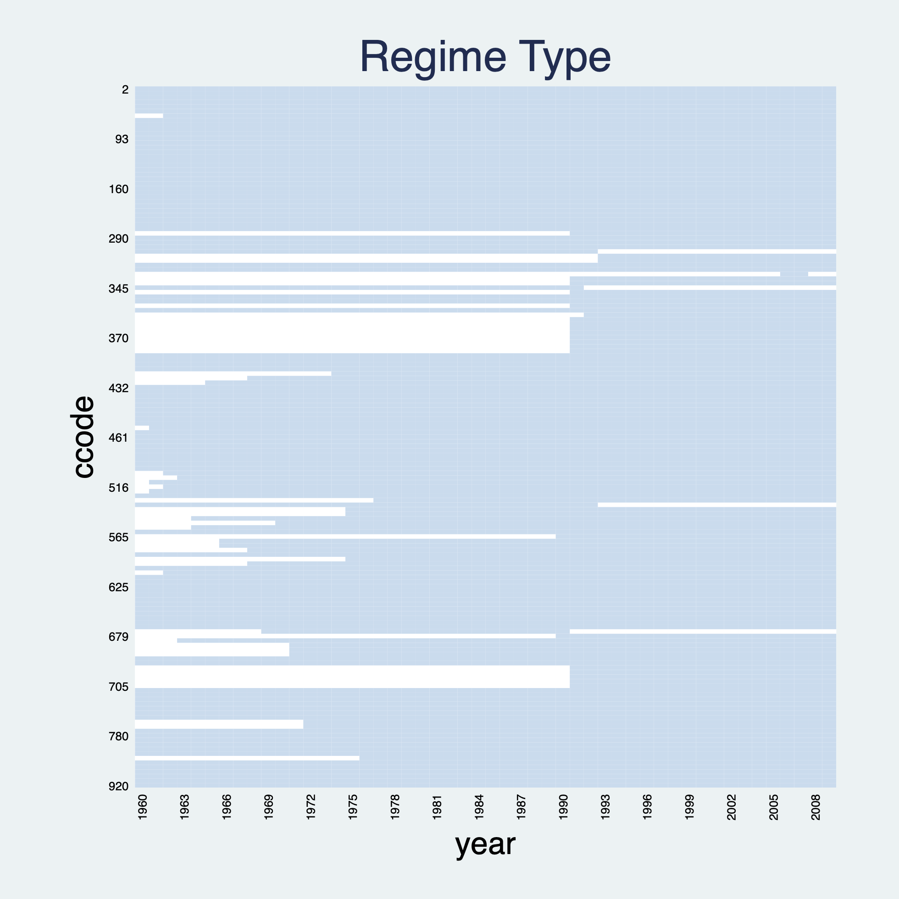

### 3.3 Treatment level = 1 & Plotting outcome

If the treatment indicator has only 1 level, then treatment status will not be shown in the `type(outcome)` plot, which is the same as `ignoretreat`: 

```
use capacity.dta, clear
gen demo2 = 0
panelview Capacity demo2 lngdp, i(ccode) t(year) type(outcome) title("Regime Type") legend(off) // type(outcome) & number of treatment level = 1: same as ignoretreat
```

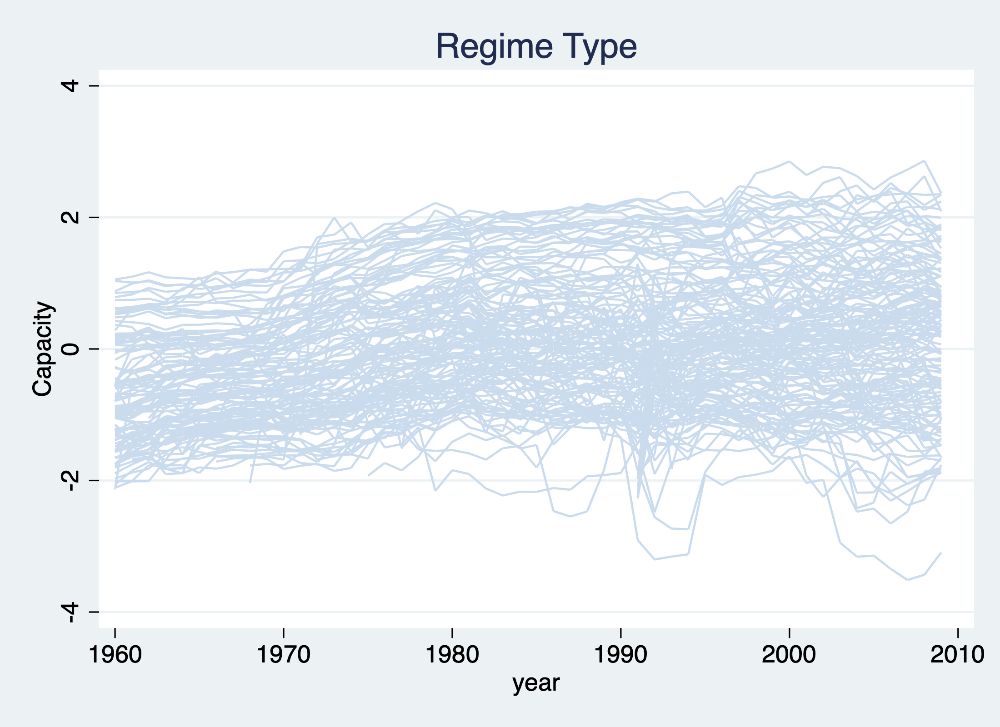

### 3.4 Plotting outcome & Continuous treatment / More than two treatment levels

If the treatment indicator has more than 2 treatment levels or is a continuous variable, then treatment status will not be shown in the `type(outcome)` plot. In other words, `type(outcome)` combined with `continuoustreat` or > 2 treatment levels is the same as  `ignoretreat`.

#### 3.4.1 Continuous outcomes

With a continuous treatment variable (e.g. `polity2`), the treatment status will not be shown on the `type(outcome)` plot. We also indicate `theme(bw)` for black and white color style.

```
use capacity.dta, clear 
* Continuous Outcome: Capacity; Continuous Treatment: polity2
panelview Capacity polity2 lngdp, i(ccode) t(year) type(outcome) title("Measuring State Capacity") legend(off) theme(bw)
```

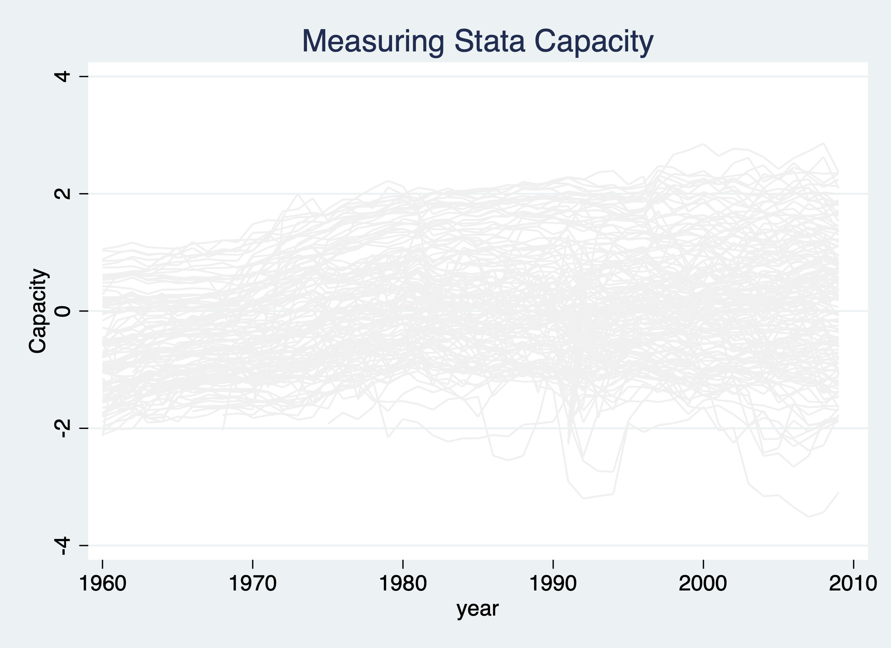

Same as the following two commands:

```
use capacity.dta, clear 
panelview Capacity demo lngdp, i(ccode) t(year) type(outcome) title("Measuring State Capacity") ignoretreat legend(off)
```

```
* Treatment indicator has more than 2 treatment levels
* Continuous Outcome: Capacity
use capacity.dta, clear
gen demo2 = 0
replace demo2 = -1 if polity2 < -0.5
replace demo2 = 1 if polity2 > 0.5
tab demo2, m 
panelview Capacity demo2 lngdp, i(ccode) t(year) type(outcome) title("Measuring State Capacity") legend(off) // number of treatment level = 3

```

####  3.4.2 Discrete outcomes

When the number of treatment levels is more than two, the treatment status will not be shown on the `type(outcome)` plot: 

```
use simdata.dta, replace
replace D = 2 if time < 5
tab D, m
panelview Y D, type(outcome) i(id) t(time) mycolor(Greens) discreteoutcome title("Raw Data") // number of treatment level = 3
```

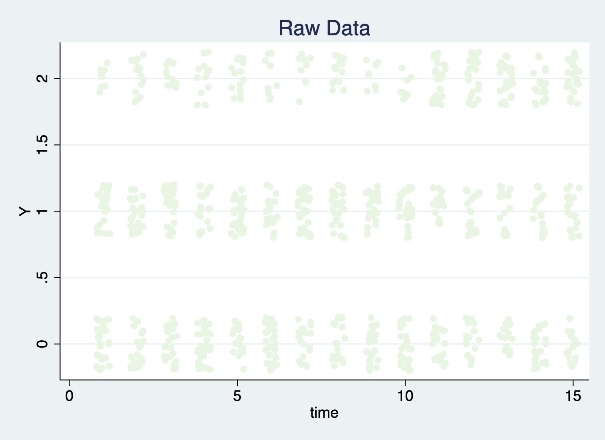

Same as the following two commands:

```
use simdata.dta, replace
panelview Y D, type(outcome) i(id) t(time) mycolor(Greens) discreteoutcome title("Raw Data") ignoretreat
```

```
use simdata.dta, replace
range x 0 1
panelview Y x, type(outcome) i(id) t(time) discreteoutcome title("Raw Data") theme(bw) // continuous treatment & black and white theme
```

------

## 4. More Than Two Treatment Conditions

### 4.1 Treatment level = 3

**panelview** supports panel data with more than 2 treatment levels. For example, we create a measure of regime type with three treatment levels: 

```
use capacity.dta, clear
gen demo2 = 0
replace demo2 = -1 if polity2 < -0.5
replace demo2 = 1 if polity2 > 0.5
panelview Capacity demo2 lngdp, i(ccode) t(year) type(treat) title("Regime Type") xlabdist(3) ylabdist(10) mycolor(Reds) // type(treat) & number of treatment level = 3
```

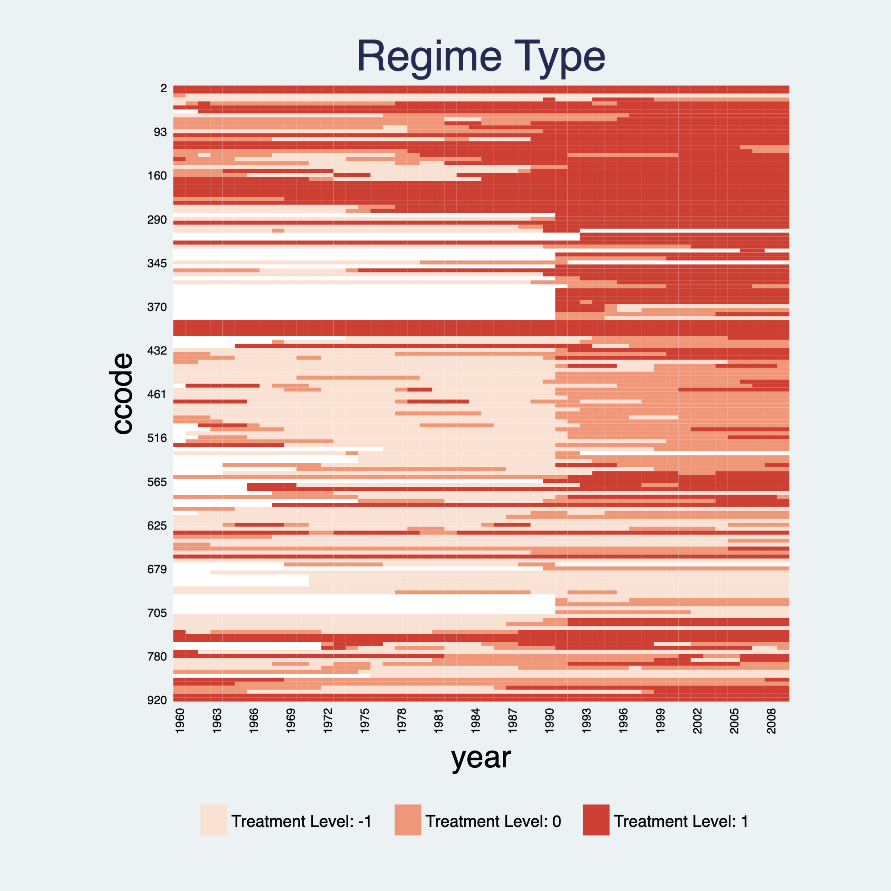

### 4.2 Treatment level = 4

```
use capacity.dta, clear
gen demo2 = 0
replace demo2 = -2 if polity2 < -0.7
replace demo2 = -1 if polity2 < -0.5 & polity2 > -0.7
replace demo2 = 1 if polity2 > 0.5
panelview Capacity demo2 lngdp, i(ccode) t(year) type(treat) title("Regime Type") xlabdist(3) ylabdist(10) mycolor(Reds) // number of treatment level = 4
```

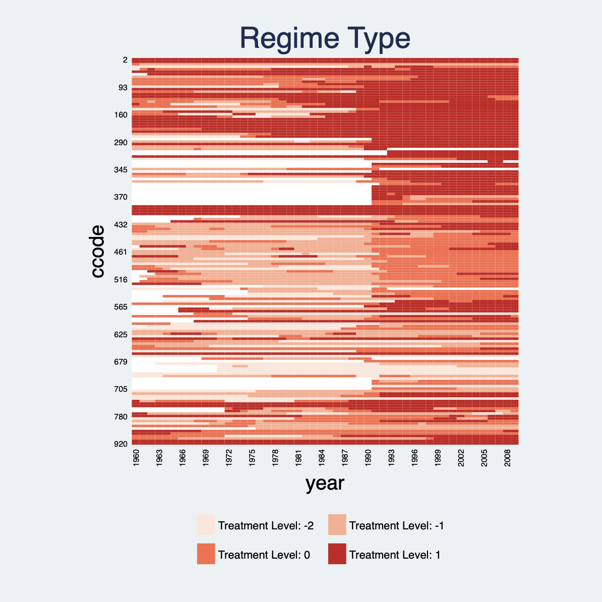

### 4.3 Treatment level >= 5

If the number of treatment levels is greater than 5, then the treatment indicator will be regarded as a continuous variable. 

```
use capacity.dta, clear
gen demo2 = 0
replace demo2 = -2 if polity2 < -0.7
replace demo2 = -1 if polity2 < -0.5 & polity2 > -0.7
replace demo2 = 1 if polity2 > 0.5 & polity2 < 0.7
replace demo2 = 2 if polity2 > 0.7
tab demo2, m 
panelview Capacity demo2 lngdp, i(ccode) t(year) type(treat) title("Regime Type") xlabdist(3) ylabdist(10)
```

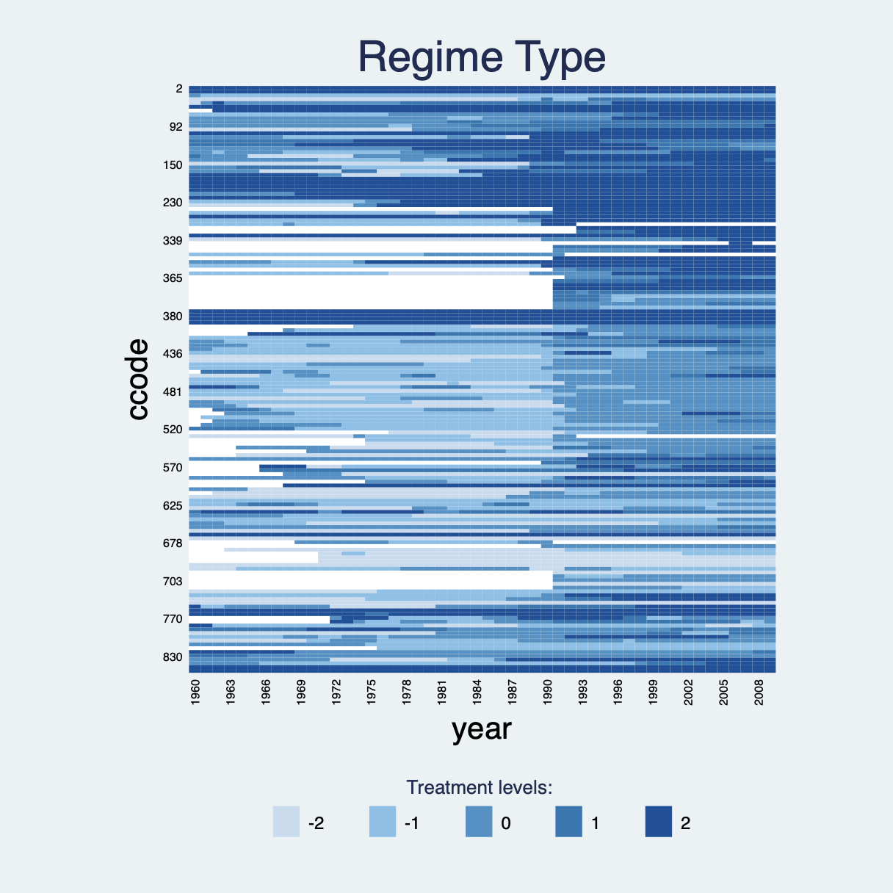

### 4.4 Continuous treatment

To plot the continuous treatment variable, we convert the continuous treatment variable into five groups according to its treatment levels. 

In the following example, `polity2` ranges from -1 to 1. When `polity2` is in the lowest category (-1), it ranges from -1 to (but not including) -0.5. When `polity2` is in the -0.5 category, it ranges from -0.5 to (but not including) 0. When `polity2` is in the 0 category, it ranges from 0 to (but not including) 0.5. When `polity2` is in the 0.5 category, it ranges from 0.5 to (but not including) 1. When `polity2` is in the 1 category, it indicates observations when `polity2` is equal to 1.

```
use capacity.dta, clear
panelview lngdp polity2, i(ccode) t(year) type(treat) mycolor(Reds) title("Regime Type") xlabdist(3) ylabdist(10) 
```


If we change the level of the continuous treatment variable, the legend will modify correspondingly: 

```
use capacity.dta, clear
replace polity2 = polity2 + 1
panelview lngdp polity2, i(ccode) t(year) type(treat) mycolor(Reds) title("Regime Type") xlabdist(3) ylabdist(10) 
```

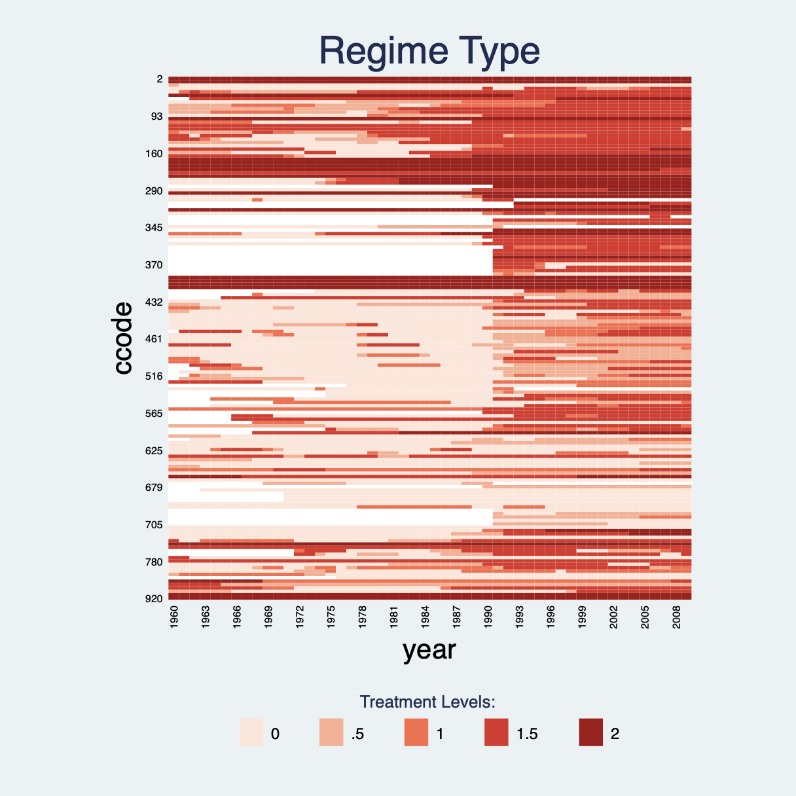

------

## 5. Continuous Outcomes

The second functionality of **panelview** is to show the raw outcome variable of a panel dataset in a time-series fashion. The syntax is very similar except that we need to specify `type(outcome)`. Different colors represent different treatment conditions.

### 5.1 Continuous outcomes

Note that we paint the period right before when the treatment begin as treated period. Different with `type(treat)`, `type(outcome)`does not need `xlabdist` and `ylabdist`. If needed, we should use  `xlabel` and `ylabel` instead.

```
* Continuous outcome: turnout: 0-100; Discrete Treatment: policy_edr: 0/1
use turnout.dta, clear 
panelview turnout policy_edr policy_mail_in policy_motor, i(abb) t(year) type(outcome) xtitle("Year") ytitle("Turnout") title("EDR Reform and Turnout") ylabel(0 (25) 100)
```

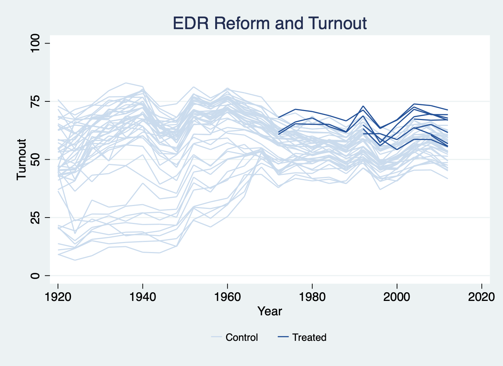

Distinguish the pre- and post-treatment periods for treated units: 

```
*prepost
panelview turnout policy_edr policy_mail_in policy_motor, i(abb) t(year) type(outcome) xtitle("Year") ytitle("Turnout") title("EDR Reform and Turnout") prepost
```

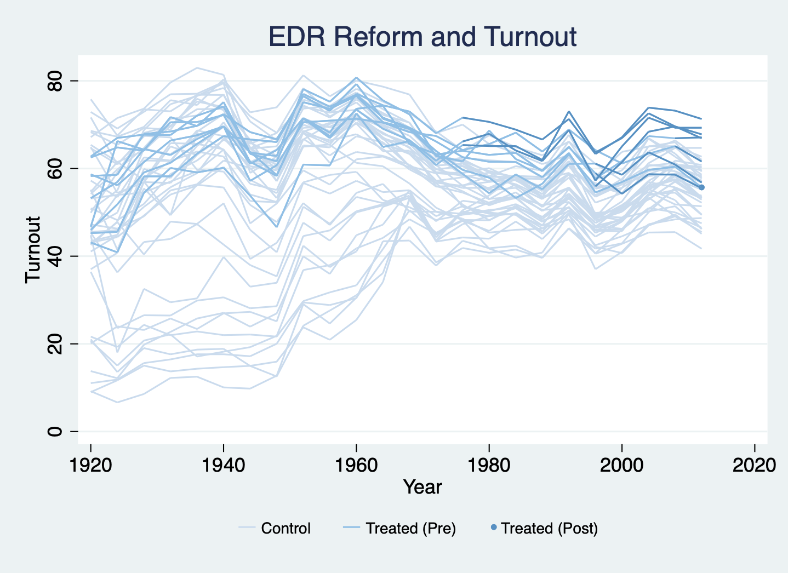

Apply the light purple to blue theme by specifying `mycolor(PuBu)`:

```
use turnout.dta, clear
panelview turnout policy_edr policy_mail_in policy_motor, i(abb) t(year) type(outcome) xtitle("Year") ytitle("Turnout") title("EDR Reform and Turnout") mycolor(PuBu)
```

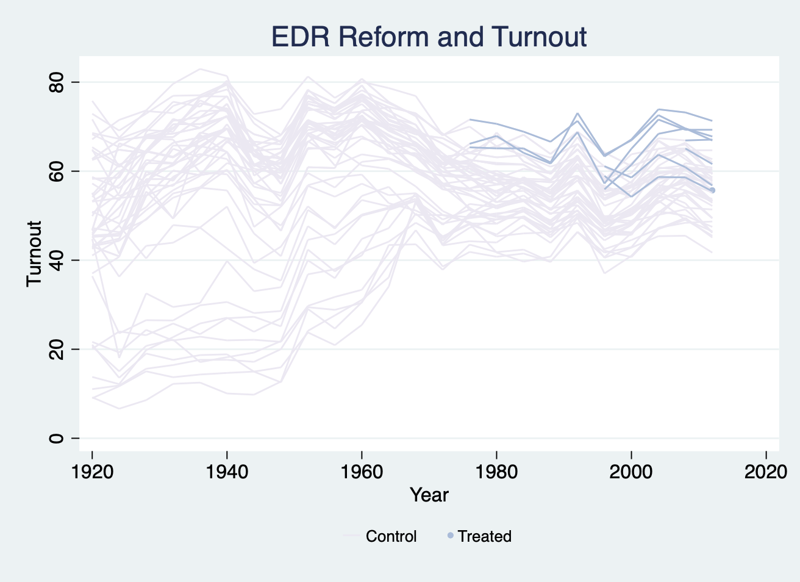

### 5.2 Specify which unit(s) we want to take a look at

We can specify which unit(s) we want to take a look at: 

```
use turnout.dta, clear 
panelview turnout policy_edr policy_mail_in policy_motor if abb == 1|abb == 2|abb == 6, i(abb) t(year) type(outcome) xtitle("Year") ytitle("Turnout") title("EDR Reform and Turnout (AL, AR, CT)") mycolor(PuBu) prepost
```

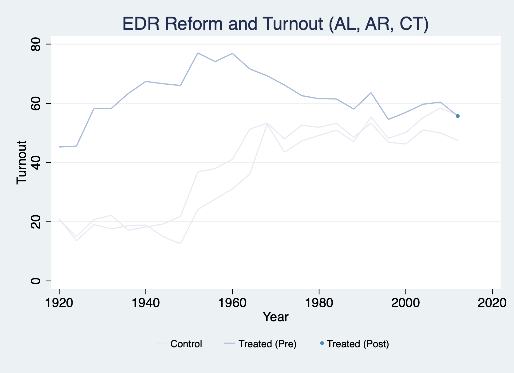

### 5.3 Put each unit into different groups, then plot respectively

To better understand the data, sometimes we want to plot the outcome based on whether the treatment status has changed during the observed time period. We can simply add options  `bygroup`. The algorithm will analyze the data and automatically put each unit into different groups, e.g. (1) units always being treated, (2) units always under control, (3) units whose treatment status has changed.

```
use turnout.dta, clear
panelview turnout policy_edr policy_mail_in policy_motor, i(abb) t(year) type(outcome) xtitle("Year") ytitle("Turnout") by(, title("EDR Reform and Turnout")) bygroup xlabel(1920 (20) 2000) 
```

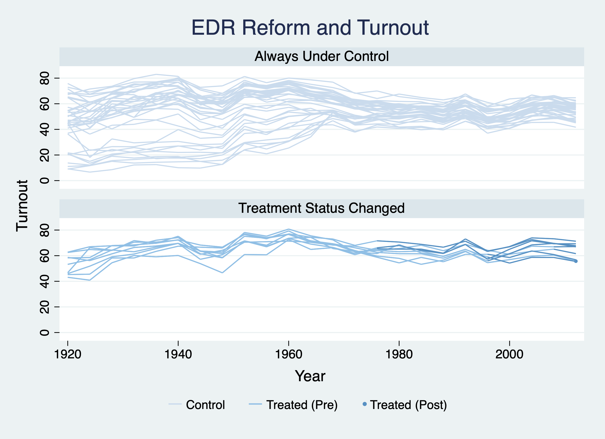

If we want to arrange the subfigures in a row rather than in a column,  use the `bygroupside` option instead of `bygroup`.

```
use turnout.dta, clear
panelview turnout policy_edr policy_mail_in policy_motor, i(abb) t(year) type(outcome) xtitle("Year") ytitle("Turnout") by(, title("EDR Reform and Turnout")) bygroupside xlabel(1920 (20) 2000) 
```

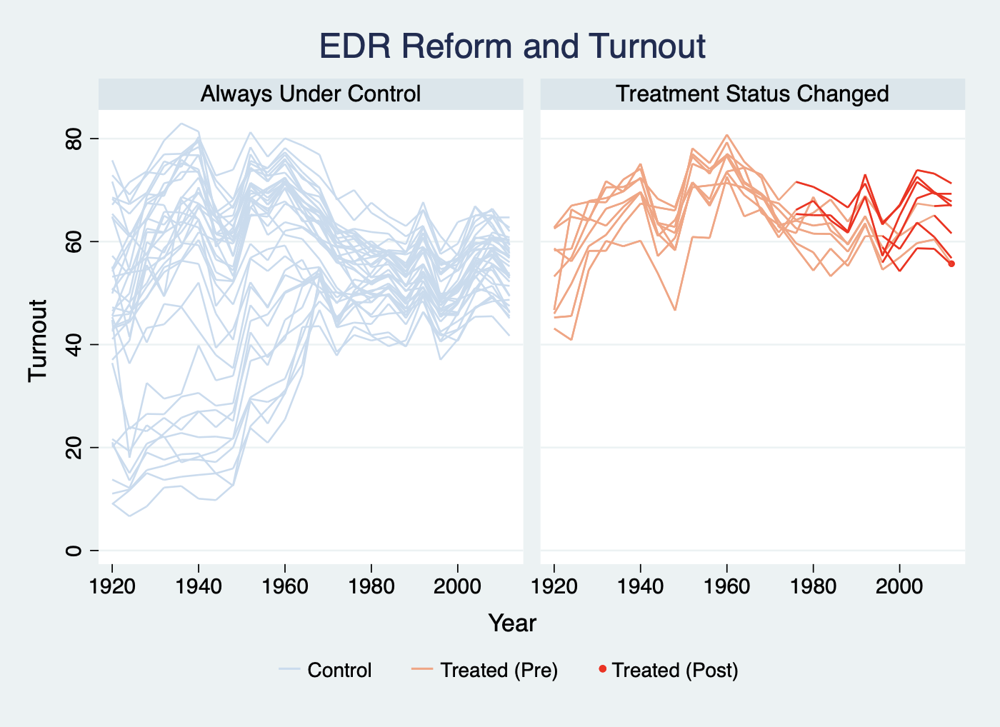

### 5.4 Outcome trajectories by cohort

Starting from v 0.1.3, users can use the `bycohort` option to plot the average outcome trajectories of units with same treatment history (if the number of unique treatment history is less than 20). This type of plots can help users diagnose the extent to which treatment effect heterogeneity may cause biases of certain estimators (e.g. the two-way fixed effects estimators).

```
use turnout.dta, clear
panelview turnout policy_edr, i(abb) t(year) type(outcome) bycohort prepost
```

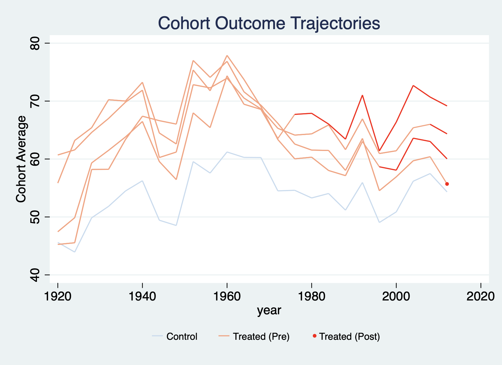

------

## 6. Discrete Outcomes 

We can accommodate discrete variables by setting `discreteoutcome`. Below is an example using the `simdata` dataset, in which the outcome variable takes three values: 0, 1, and 2.

### 6.1 Discrete outcomes

```
use simdata.dta, replace
panelview Y D if time >= 8 & time <= 15, type(outcome) i(id) t(time) mycolor(Reds) discreteoutcome title("Raw Data") xlabel(8 (2) 15) ylabel(0 (1) 2)
```

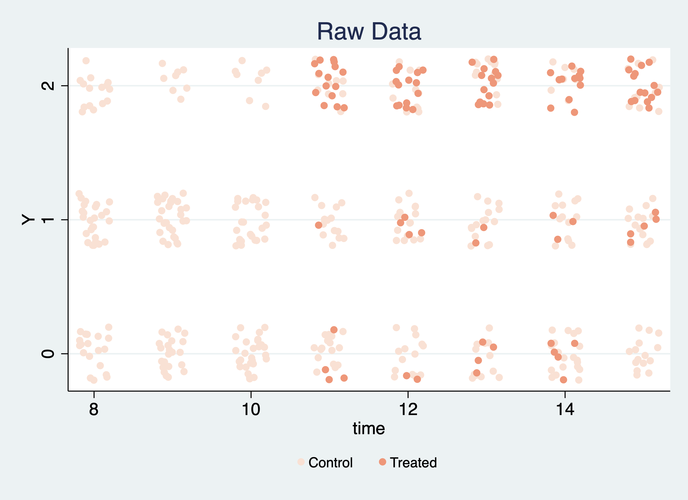

### 6.2 Put each unit into different groups, then plot respectively

We split the sample based on changes in treatment status:

```
use simdata.dta, replace
panelview Y D if time >= 8 & time <= 15, type(outcome) i(id) t(time) discreteoutcome by(,title("Raw Data")) xlabel(8 (2) 15) ylabel(0 (1) 2) bygroup
```

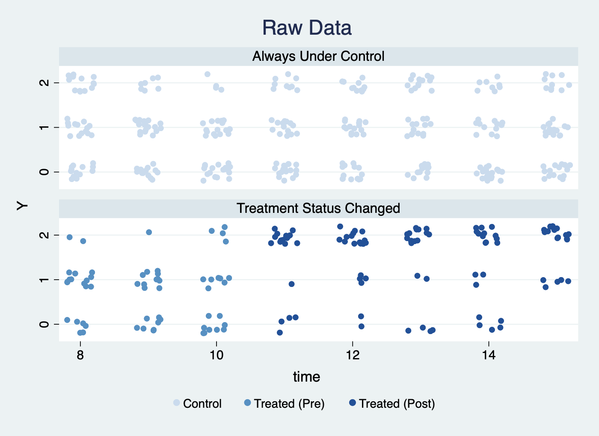

------

## 7. Plotting Any Variable In Panel Dataset

Plot an outcome variable (or any variable) in a panel dataset by `type(outcome)`: 

```
use turnout.dta, clear 
panelview turnout, i(abb) t(year) type(outcome) xtitle("Year") ytitle("Turnout") title("Turnout") ylabel(0 (25) 100)
```

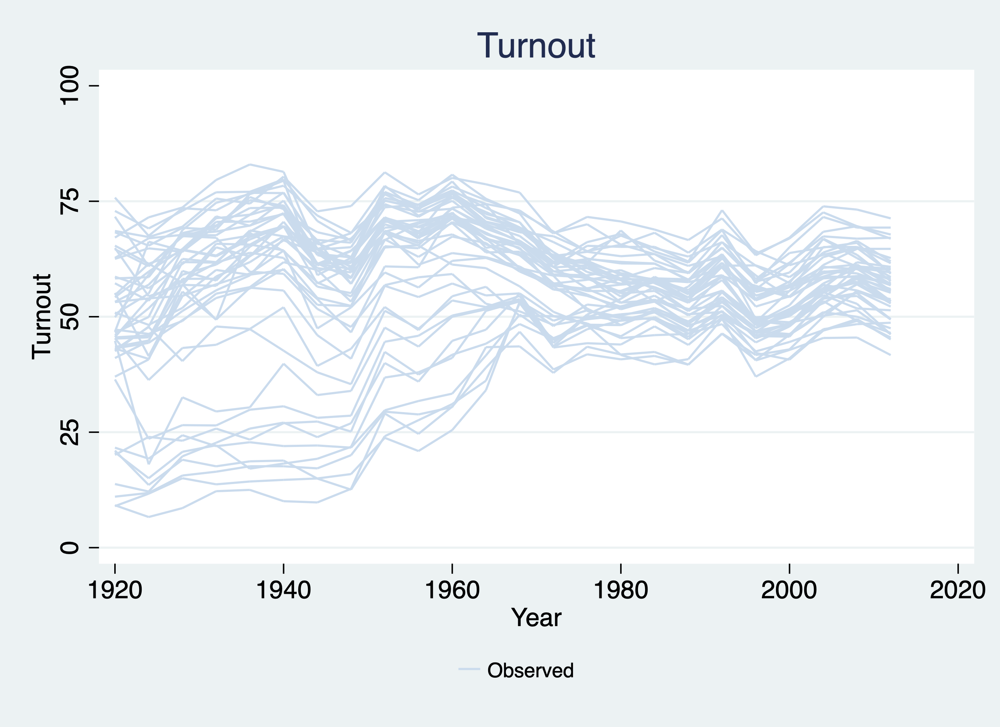

------

## 8. Plotting Y And D Time Series In One Graph

Visualize time series of the outcome and treatment in one figure by specifying `type(bivar)` or  `type(bivariate)`. For continuous variable, we use line plot as default; for discrete variable, we use bar plot. To plot connected lines ( `connected`  or  `c` ), lines ( `line`  or  `l` ), or bars ( `bar`  or  `b` ) rather than the default, please add `style( , )`, where the first element defines the outcome style, and the second defines the treatment style.

### 8.1 Plot average time series for all units

This section plots mean D and Y against time in the same graph.

With continuous outcome and discrete treatment, here are two examples. In the former one, `style(c,b)` means connected scatter instead of default line plot for the outcome and bar plot for the treatment. If any connected line, we can specify the symbol size by `msize()`: 

```
/***** 1. Y: continuous; D: discrete *****/
use turnout.dta, clear
*label the first and second y axes
panelview turnout policy_edr, i(abb) t(year) xlabdist(7) type(bivariate) msize(*0.5) style(c b) ytitle("turnout") ytitle("policy_edr", axis(2)) legend(label(1 "turnout") label(2 "policy_edr")) ylabel(40 (10) 70) ylabel(0 (0.1) 0.5, axis(2)) 
```

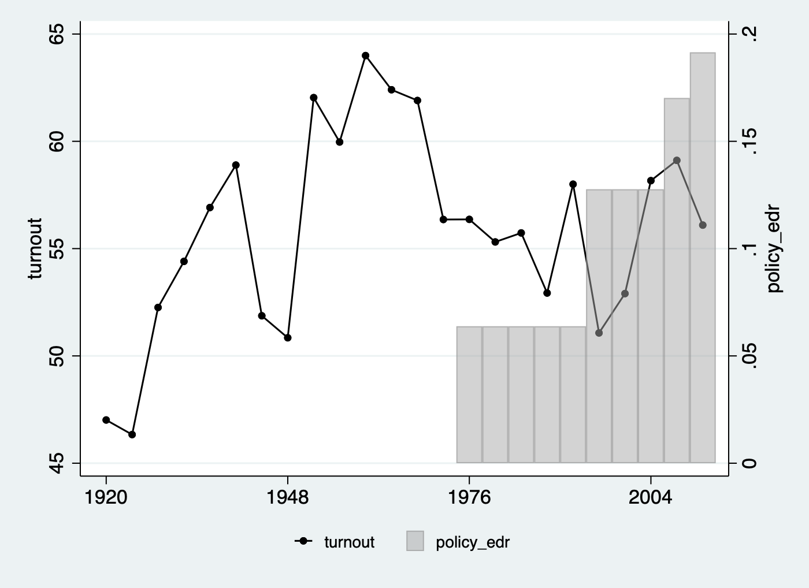

If not apply the default black and white theme, set option `mycolor()`. Besides, `lwd(medthick)` is to change the line width from the default `medium` to `medthick`:

```
use capacity.dta, clear 
panelview lnpop demo, i(country) t(year) xlabdist(10) type(bivar) mycolor(Reds) lwd(medthick)
```

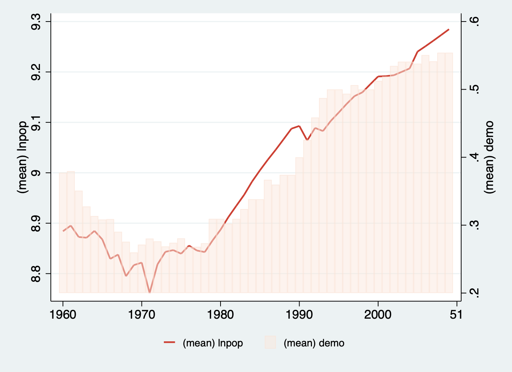

If the outcome is discrete, we can plot outcome and treatment against time in the same figure adding  `discreteoutcome`:

```
/***** 2. Y: discrete; D: discrete *****/
use simdata.dta, replace
panelview Y D,i(id) t(time) discreteoutcome xlabdist(4) type(bivar) mycolor(Reds)
```

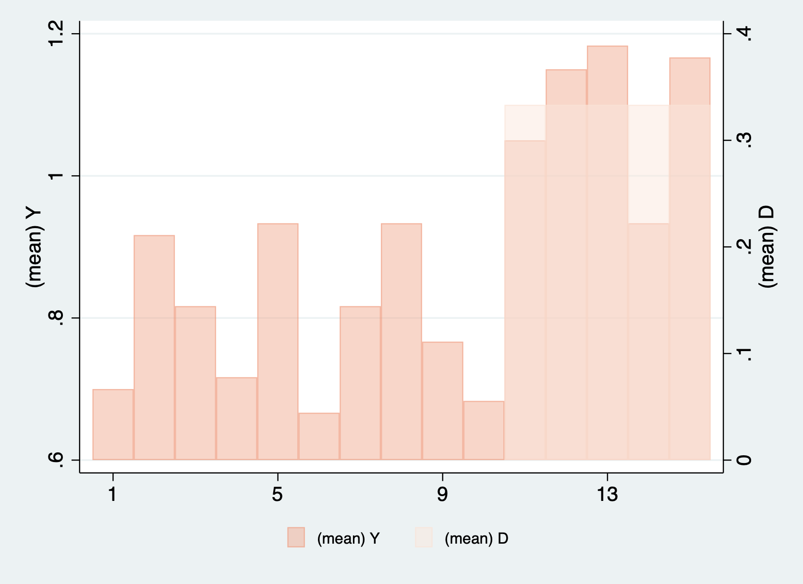

When treatment variable is continuous:  

```
/***** 3. Y: continuous; D: continuous *****/
use capacity.dta, clear 
panelview lnpop polity2, i(country) t(year) xlabdist(20) type(bivar)
```

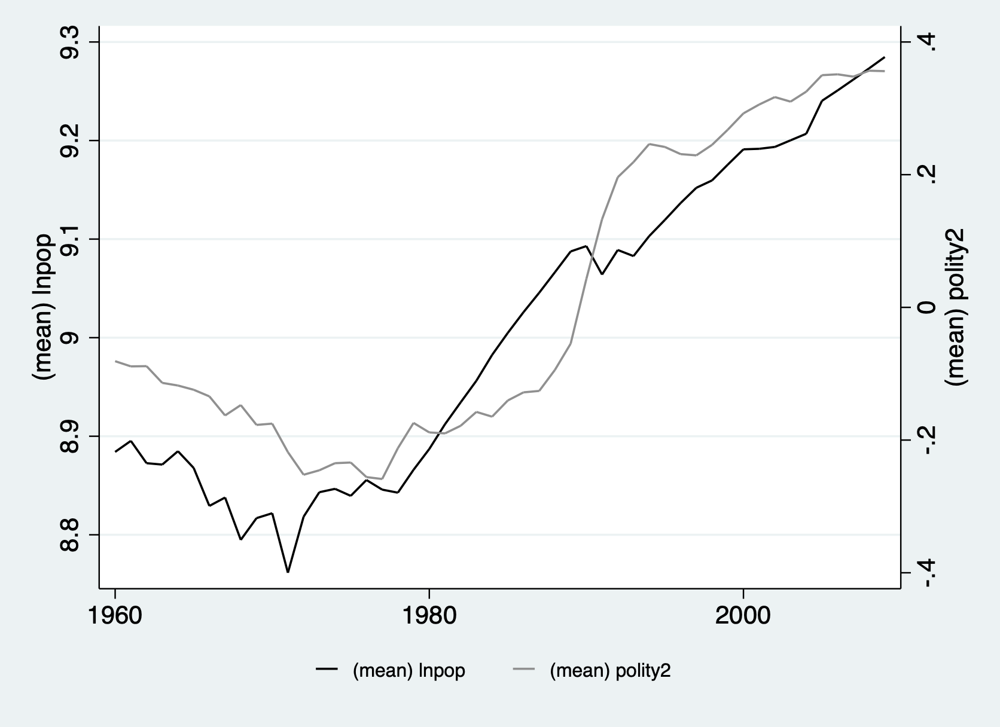

In the last situation, we plot discrete outcome and continuous treatment: 

```
/***** 4. Y: discrete; D: continuous *****/
use simdata.dta, replace
range x 0 1
panelview Y x, i(id) t(time) discreteoutcome xlabdist(4) type(bivar) style(b c)
```

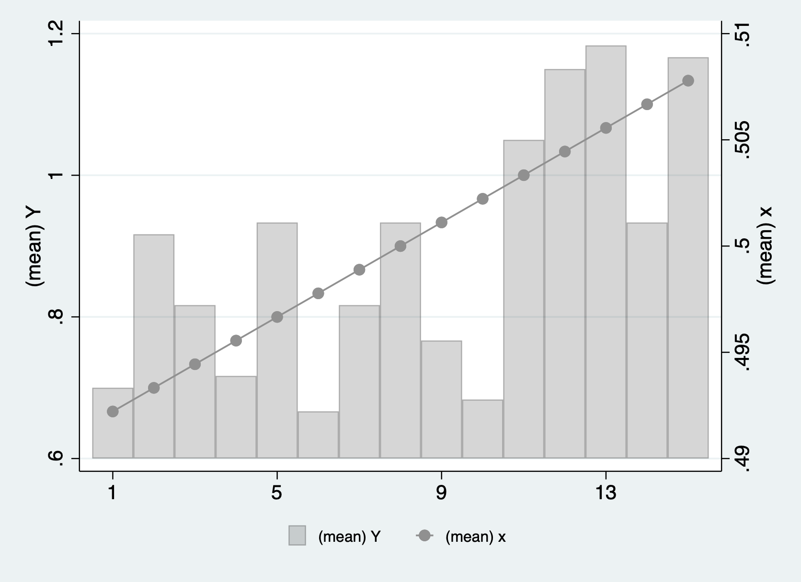

We can add `style(l,l)` or  `style(line)` to plot lines instead of bars for treatment:  

```
/***** Line the discete treatment *****/
* Y: continuous; D: discrete 
use turnout.dta, clear
panelview turnout policy_edr policy_mail_in policy_motor, i(abb) t(year) xlabdist(7) style(line) type(bivar)
```

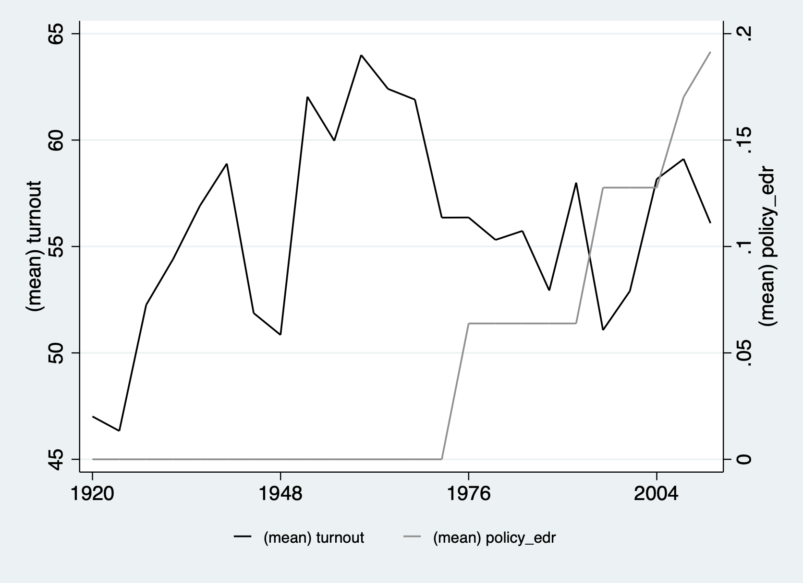

```
*Y: discrete; D: discrete
use simdata.dta, replace
panelview Y D,i(id) t(time) discreteoutcome xlabdist(4) style(line) type(bivar)
```


### 8.2 Plot by each unit

We plot D and Y against time by each unit by option `byunit`. Below are two examples with continuous outcome and discrete treatment variable. We arrange four subgraphs in one row:

```
/***** 1. Y: continuous; D: discrete *****/
use turnout.dta, clear
panelview turnout policy_edr policy_mail_in policy_motor if abb >= 1 & abb <= 12, i(abb) t(year) xlabdist(10) type(bivar) byunit
```

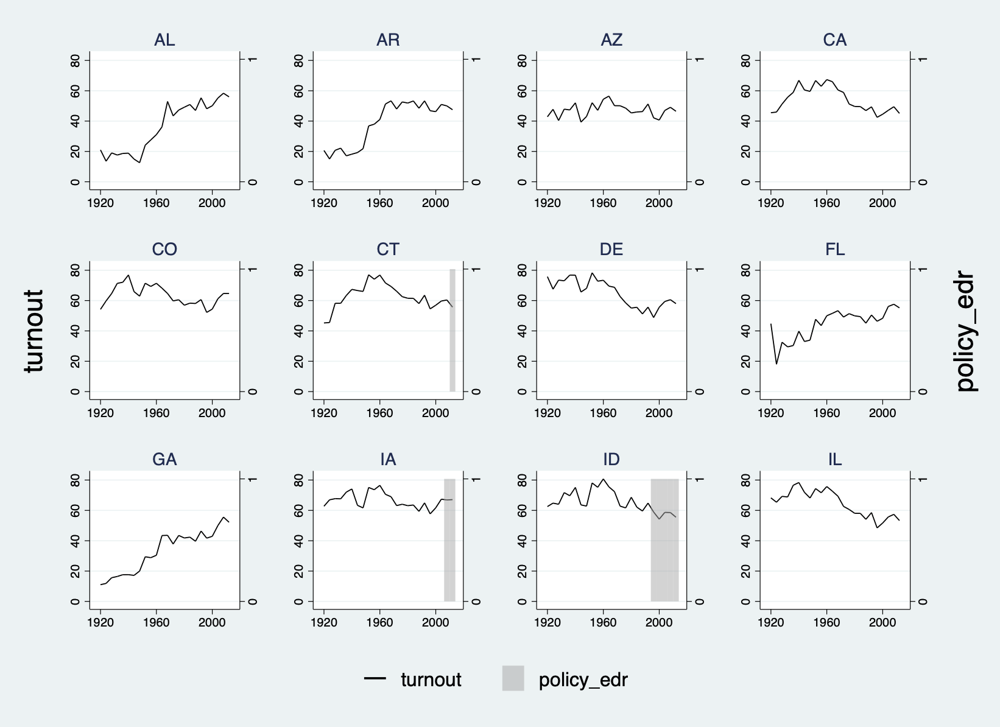

```
use capacity.dta, clear 
panelview lnpop demo if country >= 1 & country <= 24, i(country) t(year) xlabdist(20) type(bivar) byunit
```

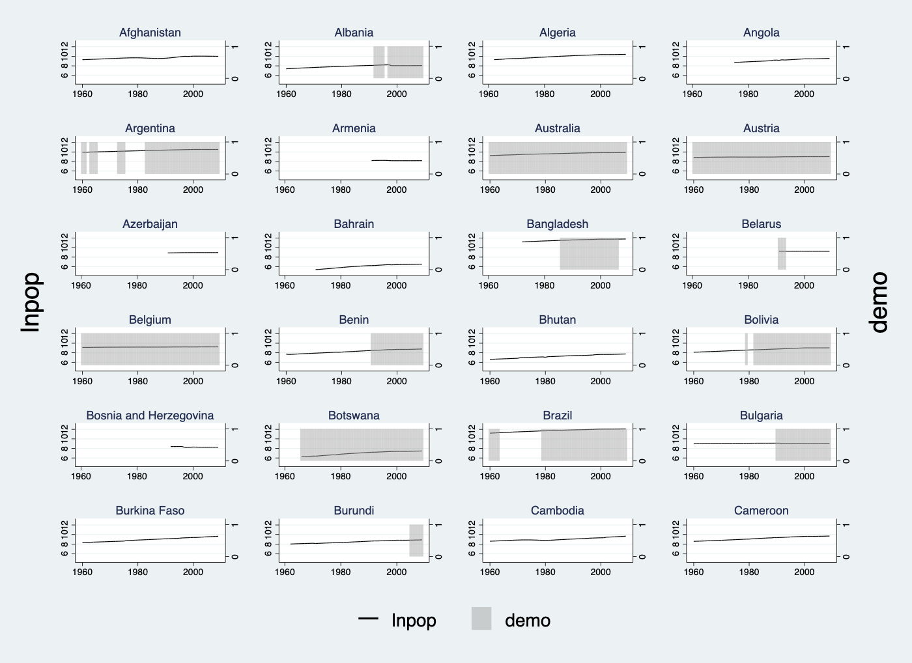

With discrete outcome and treatment:

```
/***** 2. Y: discrete; D: discrete *****/
use simdata.dta, replace
panelview Y D if id >= 101 & id <= 120,i(id) t(time) discreteoutcome xlabdist(4) type(bivar) byunit 
```

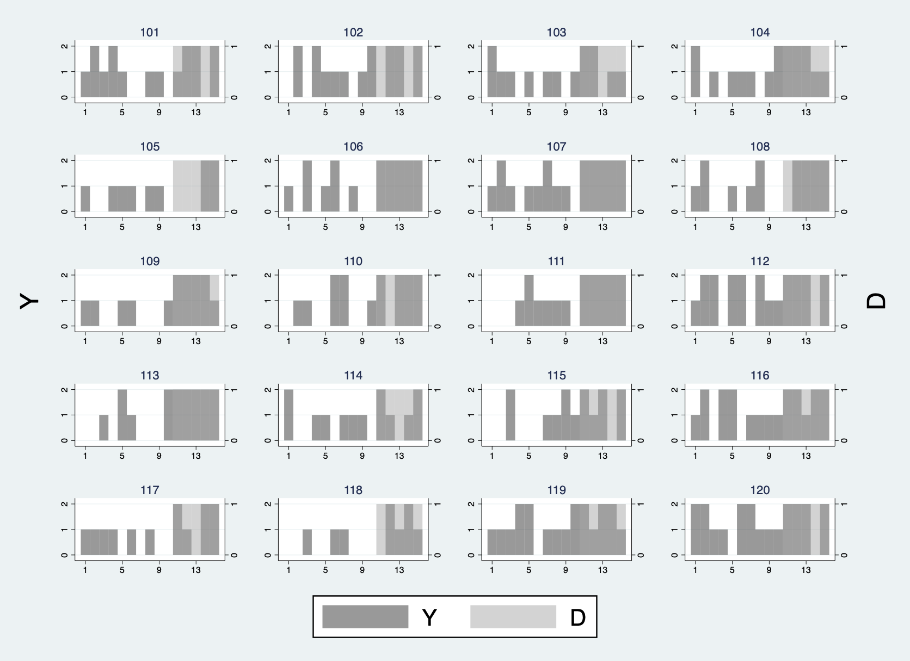

With continuous outcome and treatment:

```
/***** 3. Y: continuous; D: continuous *****/
use capacity.dta, clear 
panelview lnpop polity2 if country >= 1 & country <= 12, i(country) t(year) xlabdist(20) type(bivar) byunit
```

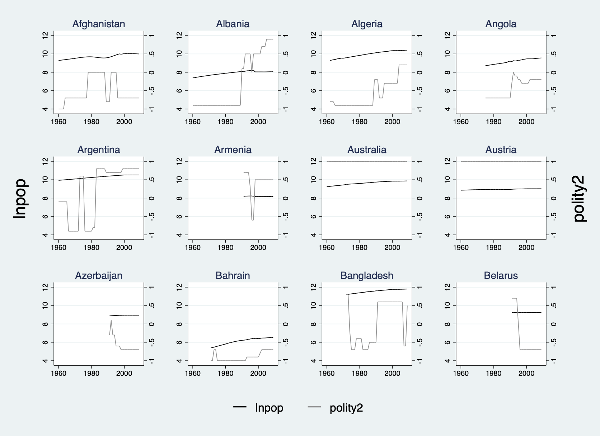

With discrete outcome and continuous treatment:

```
/***** 4. Y: discrete; D: continuous *****/
use simdata.dta, replace
range x 0 1
panelview Y x if id >= 101 & id <= 112, i(id) t(time) discreteoutcome xlabdist(4) type(bivar) byunit
```

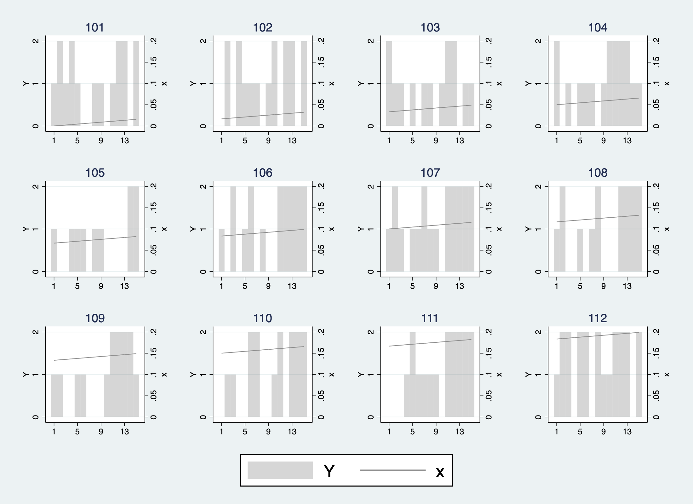

To better visualize a discrete treatment whose value is sometimes zero, add `style(l l)` to invoke line plots instead of bar plots: 

```
/***** Line the discete treatment *****/
* Y: continuous; D: discrete 
use turnout.dta, clear
panelview turnout policy_edr policy_mail_in policy_motor if abb >= 1 & abb <= 12, i(abb) t(year) xlabdist(10) style(l l) type(bivar) byunit
```

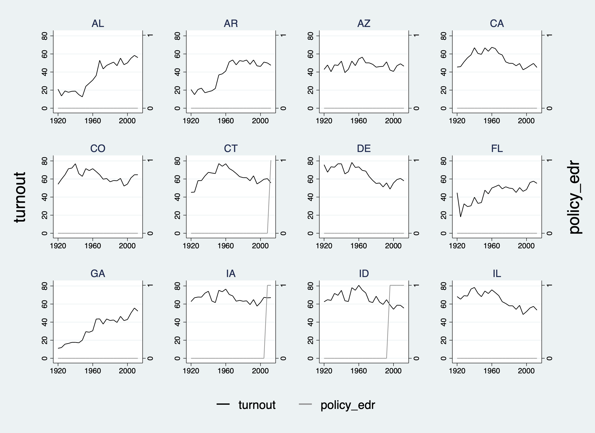

```
*Y: discrete; D: discrete
use simdata.dta, replace
panelview Y D if id >= 101 & id <= 120,i(id) t(time) discreteoutcome xlabdist(4) style(l l) type(bivar) byunit
```

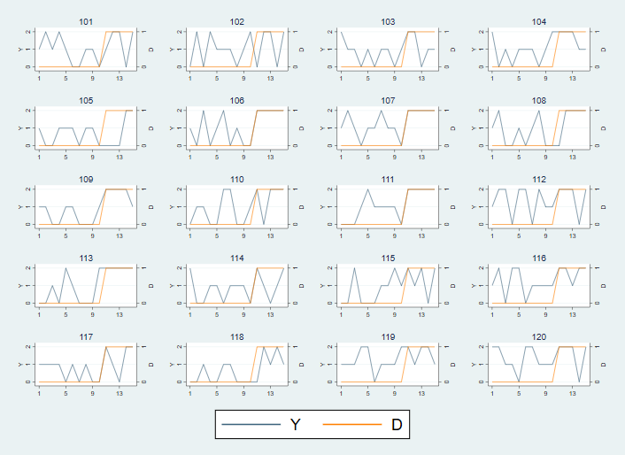
